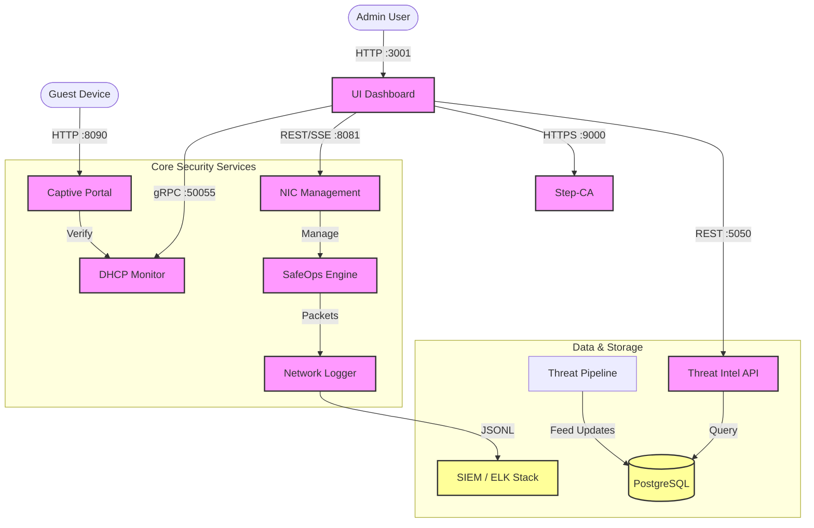

<div align="center">

# 🛡️ SafeOps Firewall V2
### Next-Generation Network Security Platform


<br/>

**Complete network visibility, threat intelligence, and access control in a single unified platform.**

[Quick Start](#-quick-start) • [Architecture](#-architecture) • [Features](#-key-features) • [📚 Documentation](#-documentation)

</div>

---

## 📚 **COMPLETE DOCUMENTATION AVAILABLE**

> ✅ **All 10 components now have detailed documentation!**
> Each doc includes file locations, functionality, ports, APIs, dependencies, configuration, and troubleshooting.

**👉 [View Complete Documentation](docs/README.md)** | **[Component Docs](docs/README.md#-complete-component-documentation)** | **[Quick Reference](docs/QUICK-REFERENCE.md)** | **[Project Stats](docs/PROJECT-STATS.md)**

**Available Documentation:**
- ✅ [SafeOps Launcher](docs/components/00-SafeOps-Launcher.md) - Service orchestrator
- ✅ [SIEM (ELK)](docs/components/01-SIEM.md) - Security monitoring
- ✅ [NIC Management](docs/components/02-NIC-Management.md) - Multi-WAN & NAT (13.5 KB)
- ✅ [DHCP Monitor](docs/components/03-DHCP-Monitor.md) - Device detection (14.7 KB)
- ✅ [Threat Intelligence](docs/components/04-Threat-Intelligence.md) - 100+ feeds **COMPLETE!**
- ✅ [Network Logger](docs/components/05-Network-Logger.md) - Packet capture **COMPLETE!**
- ✅ [SafeOps Engine](docs/components/06-SafeOps-Engine.md) - Firewall **COMPLETE!**
- ✅ [DNS Proxy](docs/components/07-DNS-Proxy.md) - DNS filtering **COMPLETE!**
- ✅ [Captive Portal](docs/components/08-Captive-Portal.md) - Device auth (12.7 KB)
- ✅ [Step-CA (PKI)](docs/components/09-Step-CA.md) - Certificate Authority (13.4 KB)

---

## 📖 Overview

**SafeOps Firewall V2** is an enterprise-grade security solution designed for comprehensive network monitoring and protection. Unlike traditional firewalls, SafeOps integrates Layer 2-7 packet inspection, real-time threat intelligence, a built-in Certificate Authority, and a captive portal into a cohesive system managed by a modern React dashboard.

> **Key Capabilities**: Unified Packet Capture • Device Trust Management • Threat Feed Aggregation • Zero-Trust Access Control • Real-Time SIEM

---

## 🏗️ Architecture

SafeOps operates a microservices architecture orchestrated by a unified launcher.



---

## 🚀 Quick Start

### Prerequisites

> 📋 **See [REQUIREMENTS.md](REQUIREMENTS.md) for complete installation guide**

- **OS**: Windows 10/11 (64-bit) (Run as Administrator)
- **Database**: PostgreSQL 15+ running on port `5432`
- **Driver**: WinpkFilter driver installed
- **Runtime**: Node.js 18+ for UI/Backend

### One-Click Launch
The unified launcher handles all service dependencies and startup sequences.

```powershell
# 1. Open PowerShell as Administrator
# 2. Navigate to project root
cd D:\SafeOpsFV2

# 3. Start the platform
.\SafeOps-Launcher.exe
```

> **What happens next?**
> - All 7 backend services start in the background.
> - The UI Dashboard automatically opens at `http://localhost:3001`.
> - A console window displays real-time health status.
> - **To Stop**: Simply press `Enter` or `Ctrl+C` in the launcher window for a graceful shutdown.

---

## ✨ Key Features

| Domain | Feature Set |
| :--- | :--- |
| **🛡️ Network Security** | • **Layer 7 Inspection**: Deep packet analysis for HTTP, DNS, and TLS.<br>• **IDS/IPS**: Real-time intrusion detection and prevention.<br>• **GeoIP Blocking**: Location-based traffic filtering. |
| **🔒 Access Control** | • **Captive Portal**: Guest authentication and device enrollment.<br>• **Step-CA**: Internal PKI for secure mTLS and certificate management.<br>• **DHCP Monitoring**: Real-time tracking of new devices on the network. |
| **🧠 Threat Intelligence** | • **Feed Aggregation**: Integrates 30+ sources (Feodo, URLhaus, Tor Exit Nodes).<br>• **Real-time Lookup**: Instant IP/Domain reputation checks.<br>• **Pattern Matching**: Heuristic analysis for unknown threats. |
| **📊 Visibility & Ops** | • **SIEM Integration**: Full logging to ELK Stack (Elasticsearch, Kibana).<br>• **NIC Management**: Multi-WAN load balancing and failover.<br>• **Live Dashboard**: React-based visual topology and traffic charts. |

---

## 🔧 Services & Configuration

All services run from the `bin/` directory and share a common configuration structure.

### Service Port Map

| Service Name | Port | Protocol | Description | Configuration File |
| :--- | :--- | :--- | :--- | :--- |
| **UI Dashboard** | `3001` | HTTP | Frontend Management Console | `src/ui/dev/vite.config.js` |
| **Threat Intel API** | `5050` | HTTP | REST API for Threat Data | `bin/threat_intel/config.yaml` |
| **NIC Management** | `8081` | REST/SSE | Interface & Traffic Control | `bin/nic_management/config.yaml` |
| **DHCP Monitor** | `50055` | gRPC | Device Discovery | `bin/dhcp_monitor/config.yaml` |
| **Step-CA** | `9000` | HTTPS | Certificate Authority | `bin/step-ca/config/ca.json` |
| **Captive Portal** | `8090` | HTTP | Guest Access Portal | `bin/captive_portal/config.yaml` |
| **SafeOps Engine** | N/A | RAW | Packet Inspection Kernel | `bin/safeops-engine/config.yaml` |

### Database Schema (PostgreSQL)

The system relies on two primary databases: `safeops` and `threat_intel_db`.

- **`threat_intel_db`**:
    - `ip_blacklist`: Known malicious IPs (34k+ records)
    - `domains`: Malicious domain names (1.1M+ records)
    - `ip_geolocation`: IP-to-Country mapping (1.1M+ records)
- **`safeops`**:
    - `devices`: Inventory of known MAC addresses and trust levels.
    - `audit_logs`: System-wide operator actions.

---

## 📂 Project Structure

```text
SafeOpsFV2/
├── SafeOps-Launcher.exe       # 🏁 Main Entry Point
├── bin/                       # 📦 Compiled Binaries
│   ├── captive_portal/        # Guest portal assets & config
│   ├── dhcp_monitor/          # DHCP logic
│   ├── network_logger/        # Traffic logs (JSONL output)
│   ├── nic_management/        # Rust-based high-perf networking
│   ├── safeops-engine/        # WinpkFilter engine
│   ├── step-ca/               # PKI infrastructure
│   └── threat_intel/          # Feed pipeline & API
├── src/                       # 🧑‍💻 Source Code
│   ├── ui/dev/                # React 19 Frontend
│   ├── launcher/              # Go Launcher Source
│   └── ... (Service Sources)
├── data/                      # 💾 Runtime Data
└── logs/                      # 📝 Application Logs
```

---

## 📚 Documentation

Detailed technical documentation is available for each subsystem:

### Quick Reference
| Document | Description |
|----------|-------------|
| **[REQUIREMENTS.md](REQUIREMENTS.md)** | 📋 Pre-installation requirements & setup guide |
| **[docs/README.md](docs/README.md)** | 📖 Documentation hub and component overview |
| **[docs/QUICK-REFERENCE.md](docs/QUICK-REFERENCE.md)** | ⚡ Quick reference for ports, paths & commands |
| **[docs/PROJECT-STATS.md](docs/PROJECT-STATS.md)** | 📊 Project statistics and codebase metrics |

### Component Documentation
| # | Component | Document |
|---|-----------|----------|
| 00 | **SafeOps Launcher** | [00-SafeOps-Launcher.md](docs/components/00-SafeOps-Launcher.md) |
| 01 | **SIEM (ELK Stack)** | [01-SIEM.md](docs/components/01-SIEM.md) |
| 02 | **NIC Management** | [02-NIC-Management.md](docs/components/02-NIC-Management.md) |
| 03 | **DHCP Monitor** | [03-DHCP-Monitor.md](docs/components/03-DHCP-Monitor.md) |
| 04 | **Threat Intelligence** | [04-Threat-Intelligence.md](docs/components/04-Threat-Intelligence.md) |
| 05 | **Network Logger** | [05-Network-Logger.md](docs/components/05-Network-Logger.md) |
| 06 | **SafeOps Engine** | [06-SafeOps-Engine.md](docs/components/06-SafeOps-Engine.md) |
| 07 | **DNS Proxy** | [07-DNS-Proxy.md](docs/components/07-DNS-Proxy.md) |
| 08 | **Captive Portal** | [08-Captive-Portal.md](docs/components/08-Captive-Portal.md) |
| 09 | **Step-CA (PKI)** | [09-Step-CA.md](docs/components/09-Step-CA.md) |

### Additional Documentation
| Document | Description |
|----------|-------------|
| [firewall-engine-implementation-plan.md](docs/firewall-engine-implementation-plan.md) | Firewall engine design & implementation plan |
| [network_manager_SPEC.md](docs/network_manager_SPEC.md) | Network manager specification |

> **Note**: For in-depth architecture details, refer to the inline comments in each service's source code under `src/`.

---

## 🛠️ Development

### Building from Source

To rebuild the Unified Launcher or any service:

```powershell
# Build Launcher
cd src/launcher
go build -o ../../SafeOps-Launcher.exe

# Build UI
cd src/ui/dev
npm install
npm run build
```

### Adding Threat Feeds

Edit `bin/threat_intel/config/sources.yaml`:

```yaml
sources:
  - name: "My Custom Feed"
    url: "https://example.com/feed.csv"
    format: "csv" # or "json", "txt"
    interval: "24h"
```

Then run the updater:
```powershell
.\bin\threat_intel\threat_intel.exe -fetch -process
```

---

## � System Requirements & Performance

### Minimum Requirements
| Resource | Requirement |
|----------|-------------|
| **OS** | Windows 10/11 (64-bit) |
| **CPU** | 4 cores (2.4 GHz+) |
| **RAM** | 4 GB |
| **Disk** | 2 GB free space |
| **Network** | Npcap driver installed |

### Expected Resource Usage

| State | CPU Usage | RAM Usage |
|-------|-----------|-----------|
| **Idle** | ~5-15% | ~500MB - 1GB |
| **Active** (packet capture, feed fetching) | ~15-35% | ~800MB - 1.5GB |

### Per-Service Breakdown

| Service | CPU (Idle) | CPU (Active) | Notes |
|---------|------------|--------------|-------|
| **DHCP Monitor** | ~1% | ~3% | ARP table polling every 30s |
| **Step-CA** | ~0-1% | ~3% | Spikes during certificate issuance |
| **SafeOps Engine** | ~2% | ~5% | Real-time packet capture |
| **Network Logger** | ~1% | ~3% | Writing packet logs to disk |
| **Threat Intel** | ~0% | ~10-20% | Spikes during feed downloads (every 30m) |
| **NIC Management** | ~0-1% | ~1% | Light REST API service |
| **Captive Portal** | ~0-1% | ~2% | Serving portal pages |
| **UI + Backend** | ~2% | ~5% | Vite HMR + Node.js API |

> **Note**: CPU percentages are approximate and measured on an Intel i7 (4-core). Actual usage varies based on network traffic volume and system configuration.

---

## �📄 License

**Proprietary & Confidential**  
Copyright (c) 2026 SafeOps Project. All Rights Reserved.  
Unauthorized copying or distribution of this software is strictly prohibited.

---
<div align="center">

**SafeOps Engineering Team** • Built with ❤️ for Secure Networks

</div>
