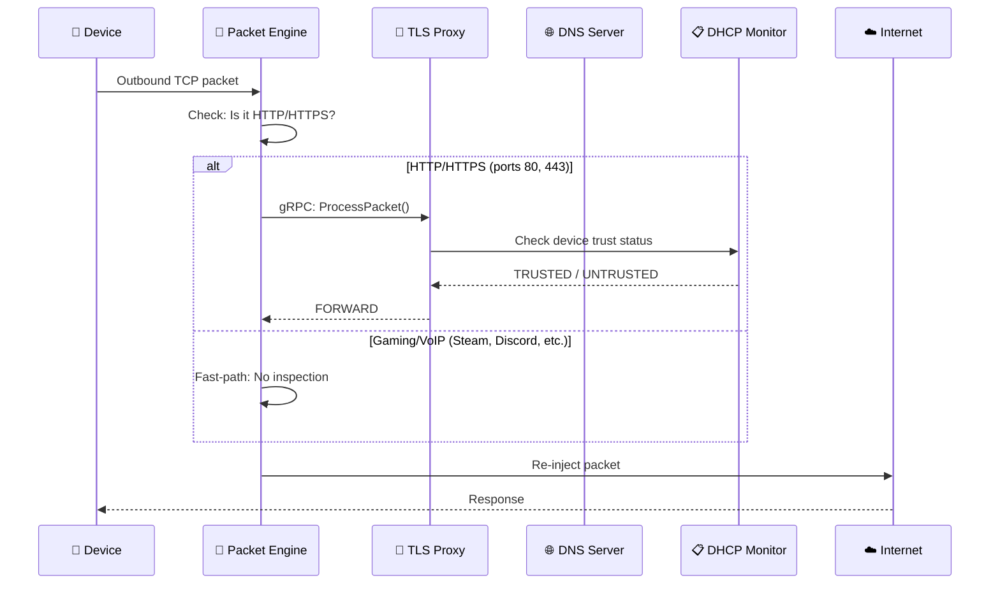

# SafeOps Firewall V2

**Enterprise-Grade Network Security Gateway for Windows Mobile Hotspot**

[](https://github.com/bakchodikarle237-afk/SafeOps-Firewall-V2)

---

## 🎯 What is SafeOps?

SafeOps is a **transparent security gateway** that intercepts, inspects, and manages all network traffic from devices connected to your Windows PC's Mobile Hotspot. Built with Rust (performance) and Go (services), it provides enterprise-grade network security for personal use.

### ✨ Key Features

| Feature | Description |
|---------|-------------|
| **🦀 Kernel-Level Packet Capture** | Rust + WinDivert intercepts all outbound traffic |
| **🔐 TLS Inspection** | Deep packet inspection for HTTP/HTTPS |
| **📋 Device Tracking** | PostgreSQL-backed device trust management |
| **🎫 Captive Portal** | Certificate distribution for device enrollment |
| **📊 Real-Time Dashboard** | React-based monitoring UI |
| **⚡ Fast-Path Gaming** | Zero-latency for gaming, VoIP, streaming |

---

## 🏗️ Architecture

```
┌─────────────────────────────────────────────────────────────────────────────┐
│                            SAFEOPSFV2 ARCHITECTURE                          │
├─────────────────────────────────────────────────────────────────────────────┤
│                                                                             │
│   📱 Mobile Devices ──────┬───────────────────────────────────────────┐    │
│   💻 Laptops             │                                            │    │
│                          ▼                                            │    │
│            ┌─────────────────────────────┐                           │    │
│            │  📡 Windows Mobile Hotspot  │                           │    │
│            │     192.168.137.1           │                           │    │
│            │   (Wi-Fi Direct Adapter)    │                           │    │
│            └─────────────┬───────────────┘                           │    │
│                          │                                            │    │
│   ┌──────────────────────▼──────────────────────────────────────────┐│    │
│   │                   SAFEOPS SERVICES                              ││    │
│   │  ┌────────────────┐  ┌────────────────┐  ┌────────────────┐    ││    │
│   │  │ 🦀 Packet      │  │ 🔐 TLS Proxy   │  │ 🌐 DNS Server  │    ││    │
│   │  │ Engine (Rust)  │◀▶│ (Go + gRPC)    │◀▶│ (Go)           │    ││    │
│   │  │ WinDivert      │  │ Port 50051     │  │ Port 5354      │    ││    │
│   │  └────────┬───────┘  └────────────────┘  └────────────────┘    ││    │
│   │           │                                                      ││    │
│   │  ┌────────▼───────┐  ┌────────────────┐  ┌────────────────┐    ││    │
│   │  │ 📋 DHCP        │  │ 🎫 Captive     │  │ 🗄️ PostgreSQL  │    ││    │
│   │  │ Monitor (Go)   │◀▶│ Portal (Go)    │◀▶│ Database       │    ││    │
│   │  │ gRPC Server    │  │ Port 8080      │  │ Port 5432      │    ││    │
│   │  └────────────────┘  └────────────────┘  └────────────────┘    ││    │
│   └─────────────────────────────────────────────────────────────────┘│    │
│                          │                                            │    │
│                          ▼                                            │    │
│              ┌───────────────────────┐                               │    │
│              │  ☁️ Internet          │                               │    │
│              └───────────────────────┘                               │    │
└─────────────────────────────────────────────────────────────────────────────┘
```

---

## 📦 Components

### Core Services

| Service | Language | Port | Purpose |
|---------|----------|------|---------|
| **Packet Engine** | Rust | - | WinDivert packet capture for hotspot traffic |
| **TLS Proxy** | Go | 50051 | gRPC server for packet decisions |
| **DNS Server** | Go | 5354 | Custom DNS with portal domain resolution |
| **DHCP Monitor** | Go | 50053 | Device tracking and trust management |
| **Captive Portal** | Go | 8080 | Certificate download portal |
| **Step-CA** | Go | 9000 | Certificate Authority (Smallstep) |
| **Backend API** | Node.js | 5050 | REST API for UI |
| **Dashboard** | React | 3001 | Real-time monitoring UI |

### Database

- **PostgreSQL** - Device registry, trust status, DHCP leases

---

## 🚀 Quick Start

### Prerequisites

- Windows 10/11 with Mobile Hotspot enabled
- Administrator privileges
- PostgreSQL installed
- Node.js 18+ / Go 1.21+ / Rust 1.70+

### 1. Clone Repository

```powershell
git clone https://github.com/bakchodikarle237-afk/SafeOps-Firewall-V2.git
cd SafeOps-Firewall-V2
```

### 2. Start All Services

```powershell
# Terminal 1: NIC Management (Packet Engine)
cd bin
.\nic_management.exe

# Terminal 2: Step-CA
cd src\step-ca
.\bin\step-ca.exe .\config\ca.json --password-file .\secrets\password.txt

# Terminal 3: DNS Server
cd bin
.\dns_server.exe

# Terminal 4: TLS Proxy
cd bin
.\tls_proxy.exe

# Terminal 5: Captive Portal
cd bin
.\captive_portal.exe

# Terminal 6: DHCP Monitor
cd bin
.\dhcp_monitor.exe

# Terminal 7: Backend API
cd backend
node server.js

# Terminal 8: UI Dashboard
cd src\ui\dev
npm run dev
```

### 3. Access Dashboard

Open browser: **http://localhost:3001**

---

## 🔄 Packet Flow

### How Traffic is Processed



### Fast-Path Ports (No Inspection)

These ports bypass TLS inspection for low-latency:
- **Gaming:** 27000-27050 (Steam), 25565 (Minecraft), 7777-7778 (Unreal)
- **VoIP:** 50000-65535 (Discord), 8801-8810 (Zoom)
- **Remote:** 22 (SSH), 3389 (RDP)

---

## 📊 Dashboard Features

### Network Monitor

| Feature | Description |
|---------|-------------|
| **Device List** | Connected devices with MAC, IP, certificate status |
| **Intelligent Filtering** | Auto-hides PC NICs, shows only client devices |
| **Active Now Counter** | Real-time count of hotspot devices |
| **QR Code Portal** | Scan to access certificate installation |
| **Service Endpoints** | Quick links to all service URLs |

### Device Trust Status

| Status | Meaning |
|--------|---------|
| 🟢 TRUSTED | Certificate installed |
| 🟡 UNTRUSTED | Pending certificate installation |
| 🔴 BLOCKED | Manually blocked device |

---

## 🎫 Captive Portal

### Certificate Installation Flow

1. **Device connects** to Mobile Hotspot → Gets IP 192.168.137.x
2. **User scans QR code** or opens http://192.168.137.1:8080
3. **Downloads certificate** → SafeOps_RootCA.crt
4. **Installs certificate** → Manual step (OS security)
5. **Device marked TRUSTED** → Full internet access

### Portal Endpoints

| Endpoint | Purpose |
|----------|---------|
| `GET /` | Portal landing page |
| `GET /api/download-ca` | Download root certificate |
| `POST /api/skip` | Allow internet without cert |
| `GET /api/status` | Device trust status |

---

## 🗄️ Database Schema

```sql
-- Core device table
CREATE TABLE devices (
    device_id UUID PRIMARY KEY,
    mac_address TEXT UNIQUE,
    current_ip INET,
    hostname TEXT,
    vendor TEXT,
    device_type TEXT,
    trust_status TEXT,  -- TRUSTED, UNTRUSTED, BLOCKED
    ca_cert_installed BOOLEAN,
    portal_shown BOOLEAN,
    interface_name TEXT,
    status TEXT,
    first_seen TIMESTAMP,
    last_seen TIMESTAMP
);
```

---

## 🔧 Configuration

### Environment Variables

```bash
# PostgreSQL
DB_HOST=localhost
DB_PORT=5432
DB_USER=safeops
DB_PASSWORD=SafeOps2024!
DB_NAME=safeops

# TLS Proxy
TLS_PROXY_ADDRESS=http://localhost:50051

# Captive Portal
PORTAL_HTTP_PORT=8080
PORTAL_HTTPS_PORT=8444
```

### Key Config Files

| File | Purpose |
|------|---------|
| `config/safeops.toml` | Main configuration |
| `src/step-ca/config/ca.json` | Step-CA configuration |
| `backend/.env` | Backend API environment |

---

## 📁 Project Structure

```
SafeOpsFV2/
├── bin/                          # Compiled binaries
│   ├── nic_management.exe        # Packet Engine (Rust)
│   ├── tls_proxy.exe             # TLS Proxy (Go)
│   ├── dns_server.exe            # DNS Server (Go)
│   ├── dhcp_monitor.exe          # DHCP Monitor (Go)
│   └── captive_portal.exe        # Captive Portal (Go)
│
├── backend/                      # Node.js API
│   ├── server.js                 # Express server
│   ├── routes/                   # API routes
│   │   ├── devices.js            # Device management
│   │   └── threat-intel.js       # Threat intelligence
│   └── db.js                     # PostgreSQL connection
│
├── src/
│   ├── nic_management/           # 🦀 Rust packet capture
│   │   └── internal/bin/
│   │       └── packet_engine.rs  # Main WinDivert capture
│   │
│   ├── tls_proxy/                # 🔐 Go TLS inspection
│   │   ├── internal/grpc/        # gRPC servers
│   │   ├── internal/brain/       # Decision engine
│   │   └── proto/                # Protocol buffers
│   │
│   ├── dns_server/               # 🌐 Go DNS server
│   │
│   ├── dhcp_monitor/             # 📋 Go device tracking
│   │   ├── internal/database/    # PostgreSQL queries
│   │   └── internal/grpc/        # gRPC server
│   │
│   ├── captive_portal/           # 🎫 Go captive portal
│   │   ├── internal/server/      # HTTP handlers
│   │   └── internal/static/      # Web assets
│   │
│   ├── step-ca/                  # 🔒 Certificate Authority
│   │
│   └── ui/dev/                   # 📊 React Dashboard
│       └── src/pages/
│           └── DHCPMonitor.jsx   # Network Monitor page
│
└── config/                       # Configuration files
```

---

## 🛠️ Development

### Build Commands

```powershell
# Build Packet Engine (Rust)
cd src\nic_management
cargo build --release

# Build Go services
cd src\tls_proxy && go build -o ..\..\bin\tls_proxy.exe ./cmd
cd src\dns_server && go build -o ..\..\bin\dns_server.exe ./cmd
cd src\dhcp_monitor && go build -o ..\..\bin\dhcp_monitor.exe ./cmd
cd src\captive_portal && go build -o ..\..\bin\captive_portal.exe ./cmd

# Build UI
cd src\ui\dev
npm install && npm run build
```

### Run Development Workflow

Use the workflow command:
```powershell
# See .agent/workflows/dev.md for full instructions
```

---

## 📈 Performance

| Metric | Value |
|--------|-------|
| Packet Capture | ~10,000 pps sustained |
| TLS Decision Latency | <5ms |
| Fast-Path Latency | <1ms |
| Memory Usage | ~100MB per service |
| Device Capacity | Unlimited (database-backed) |

---

## 🔐 Security Design

### Principles

- **Fail-Open:** If TLS Proxy is unavailable, traffic forwards normally
- **Manual Portal:** No DNS hijacking - users choose to install cert
- **Hotspot Isolation:** Only 192.168.137.x traffic is captured
- **Localhost Protection:** 127.x.x.x traffic is never intercepted

### Trust Workflow

```
New Device → UNTRUSTED → Visit Portal → Download Cert → Install → TRUSTED
```

---

## 📞 Troubleshooting

### Services Won't Start?

```powershell
# Check if running as Administrator
# Check port availability
netstat -ano | findstr ":5050 :8080 :50051 :5354"
```

### No Devices in Dashboard?

1. Check backend API: `curl http://localhost:5050/health`
2. Check PostgreSQL is running
3. Verify hotspot is enabled

### Rate Limiting Errors (429)?

The backend is configured for 1000 requests per 15 minutes. If you see 429 errors, restart the backend server.

---

## 📚 Documentation

| Document | Purpose |
|----------|---------|
| [ARCHITECTURE_DECISIONS.md](ARCHITECTURE_DECISIONS.md) | Technical decisions |
| [src/README.md](src/README.md) | Source code overview |
| [docs/PACKET_ENGINE.md](docs/PACKET_ENGINE.md) | Packet Engine deep dive |

---

## 🤝 Contributing

```
1. Fork the repository
2. Create feature branch: git checkout -b feature/amazing-feature
3. Commit changes: git commit -m 'feat: add amazing feature'
4. Push to branch: git push origin feature/amazing-feature
5. Open Pull Request
```

---

## 📄 License

- **SafeOps Code:** Proprietary
- **Step-CA:** Apache 2.0 (FREE)
- **WinDivert:** LGPLv3

---

## 🙏 Credits

- **Smallstep** - Step-CA Certificate Authority
- **Basil** - WinDivert packet capture library
- **React** - Dashboard UI framework

---

**SafeOps Firewall V2** - *Secure your network, your way*
