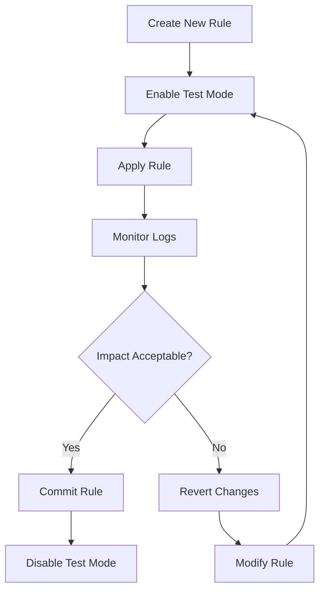
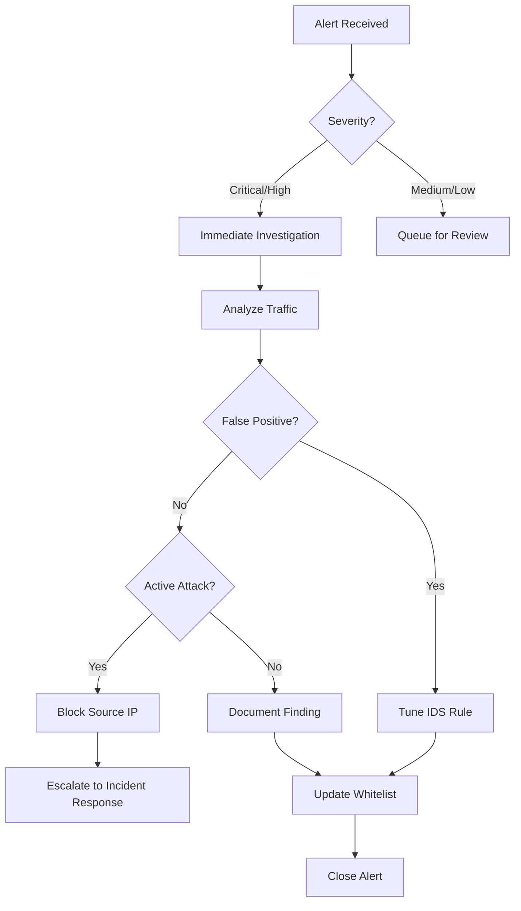
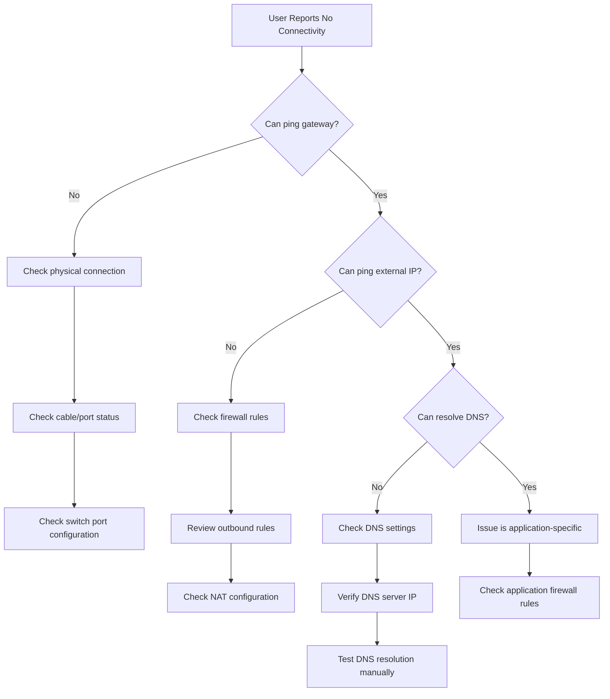
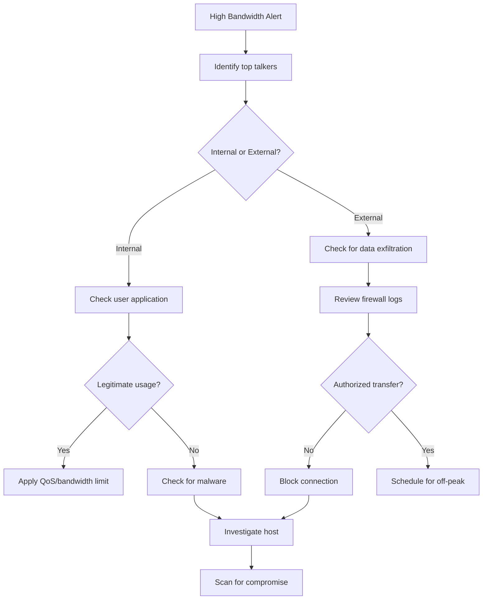
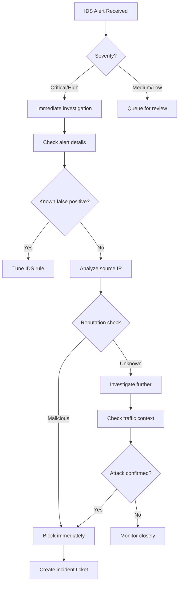
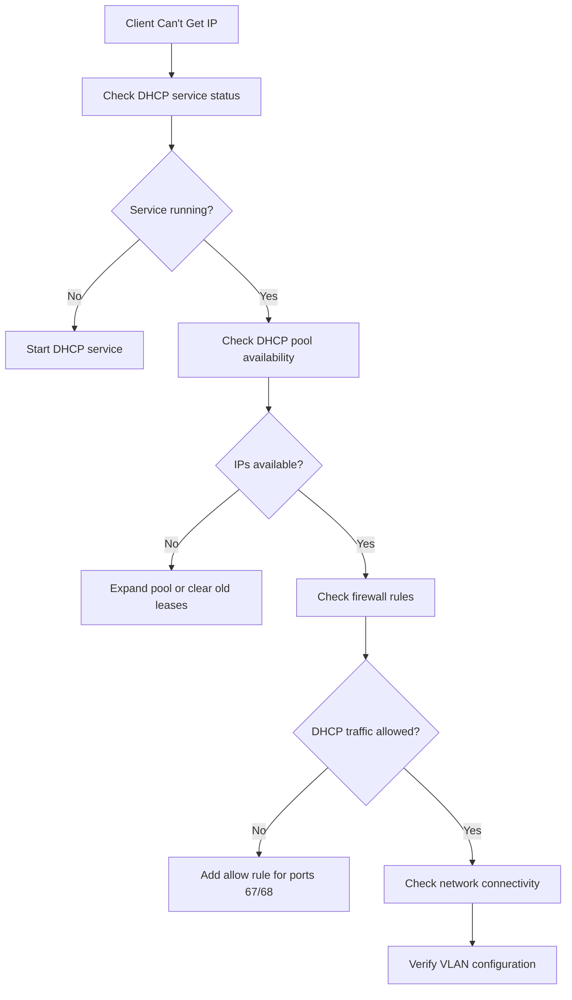
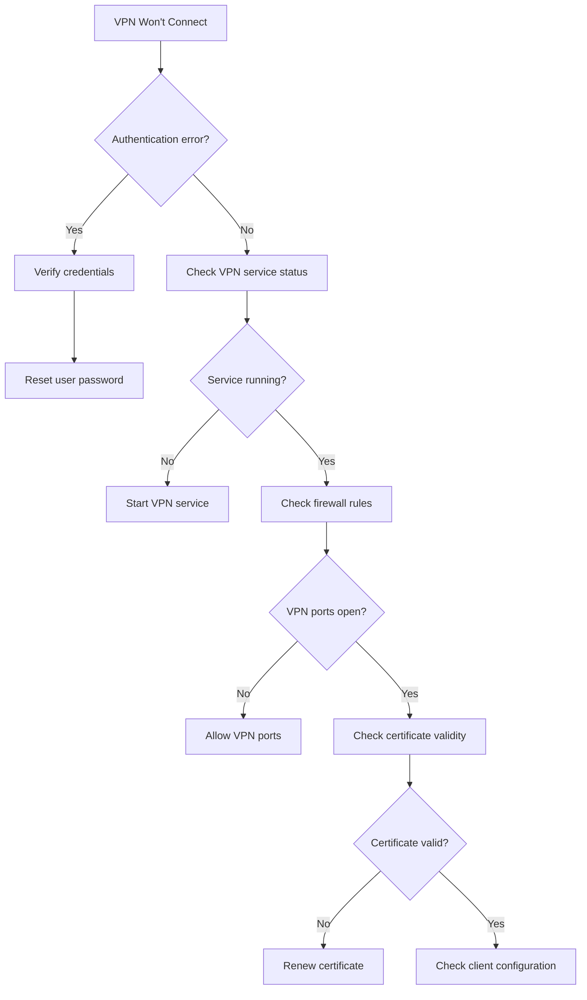

# SafeOps v2.0 - Network Operations Guide

## 📋 Document Overview

**Purpose:** Comprehensive operational guide for network administrators managing day-to-day operations with SafeOps v2.0  
**Audience:** Network administrators, security operators, NOC staff  
**Last Updated:** December 2025  
**Version:** 2.0

---

## 📖 Table of Contents

1. [Network Monitoring](#network-monitoring)
2. [Firewall Management](#firewall-management)
3. [DNS and DHCP](#dns-and-dhcp)
4. [Security Operations](#security-operations)
5. [User Management](#user-management)
6. [Maintenance Tasks](#maintenance-tasks)
7. [Daily Tasks Checklist](#daily-tasks-checklist)
8. [Weekly Tasks Checklist](#weekly-tasks-checklist)
9. [Monthly Tasks Checklist](#monthly-tasks-checklist)
10. [Troubleshooting Flowcharts](#troubleshooting-flowcharts)

---

## 🔍 Network Monitoring

### Viewing Real-Time Traffic

#### Using the Windows Desktop App

1. **Open SafeOps Dashboard**
   - Launch the SafeOps application from Start Menu
   - Dashboard shows live traffic statistics by default

2. **Real-Time Traffic View**
   ```
   Navigation: Dashboard → Network Monitoring → Live Traffic
   ```

**Dashboard Display:**
```
╔═══════════════════════════════════════════════════════════════╗
║ SafeOps Network Monitor - Live Traffic                       ║
╠═══════════════════════════════════════════════════════════════╣
║                                                               ║
║ Total Bandwidth:                                              ║
║   ⬆ Upload:    ▓▓▓▓▓▓░░░░  245 Mbps / 1 Gbps                ║
║   ⬇ Download:  ▓▓▓▓▓▓▓▓░░  387 Mbps / 1 Gbps                ║
║                                                               ║
║ Active Connections: 1,247    Packet Rate: 45,892 PPS         ║
║                                                               ║
║ Protocol Distribution:                                        ║
║   TCP:  ████████████████░░░░  78% (972 connections)          ║
║   UDP:  ████░░░░░░░░░░░░░░░░  18% (224 connections)          ║
║   ICMP: ░░░░░░░░░░░░░░░░░░░░   4% ( 51 connections)          ║
║                                                               ║
║ Traffic Graph (Last 5 minutes):                              ║
║   1 Gbps ┤                                    ╭─╮             ║
║          ┤                          ╭─╮     ╭─╯ ╰─╮           ║
║   500M   ┤              ╭─╮      ╭─╯ ╰─╮ ╭─╯     │           ║
║          ┤         ╭────╯ ╰──────╯     ╰─╯        │           ║
║   0      ┼─────────╯                               ╰───────── ║
║          └──────────────────────────────────────────────────  ║
║            -5m    -4m    -3m    -2m    -1m     Now           ║
║                                                               ║
║ [1 min] [5 min] [1 hour] [24 hours]    Auto-refresh: ● 5s   ║
╚═══════════════════════════════════════════════════════════════╝
```

   - **Total Bandwidth:** Current upload/download speeds
   - **Active Connections:** Live connection count
   - **Protocol Distribution:** TCP/UDP/ICMP breakdown
   - **Packet Rate:** Packets per second (PPS)

3. **Traffic Graphs**
   - **1-minute view:** Real-time spikes and anomalies
   - **5-minute view:** Short-term trending
   - **1-hour view:** Medium-term analysis
   - Auto-refresh interval: 5 seconds (configurable)

#### Using CLI Tools

```powershell
# View current traffic statistics
safeops-cli stats show --live

# Monitor specific interface
safeops-cli stats show --interface eth0 --live

# Export to JSON for analysis
safeops-cli stats export --format json --output traffic.json
```

### Identifying Top Talkers

#### Desktop App Method

1. **Navigate to Top Talkers**
   ```
   Dashboard → Network Monitoring → Top Talkers
   ```

**Top Talkers Display:**
```
╔═══════════════════════════════════════════════════════════════════════╗
║ Top Bandwidth Consumers (Last Hour)                                  ║
╠═══════════════════════════════════════════════════════════════════════╣
║ Filter: [By Bandwidth ▼] [All VLANs ▼] [Last 1 hour ▼]    [Refresh] ║
╠═══════════════════════════════════════════════════════════════════════╣
║ Rank │ IP Address      │ Hostname         │ VLAN  │ Data Used │ %   ║
╠══════╪═════════════════╪══════════════════╪═══════╪═══════════╪══════╣
║  1   │ 192.168.10.105  │ workstation-42   │ 10    │ 15.2 GB   │ 22% ║
║  2   │ 192.168.10.087  │ laptop-finance   │ 10    │ 12.8 GB   │ 18% ║
║  3   │ 192.168.10.143  │ desktop-mkt      │ 10    │  8.3 GB   │ 12% ║
║  4   │ 192.168.20.055  │ server-backup    │ 20    │  7.1 GB   │ 10% ║
║  5   │ 192.168.10.201  │ ceo-laptop       │ 10    │  5.9 GB   │  8% ║
║  6   │ 192.168.30.012  │ dev-workstation  │ 30    │  4.2 GB   │  6% ║
║  7   │ 192.168.10.089  │ sales-pc-03      │ 10    │  3.8 GB   │  5% ║
║  8   │ 192.168.20.100  │ file-server      │ 20    │  3.1 GB   │  4% ║
║  9   │ 192.168.10.134  │ hr-laptop-02     │ 10    │  2.9 GB   │  4% ║
║ 10   │ 192.168.30.045  │ build-server     │ 30    │  2.5 GB   │  3% ║
╠═══════════════════════════════════════════════════════════════════════╣
║ Total Traffic: 68.4 GB               Other Hosts: 3.2 GB (5%)        ║
║                                                                       ║
║ Right-click for options: View Details | Limit Bandwidth | Block      ║
╚═══════════════════════════════════════════════════════════════════════╝
```

2. **View Options**
   - **By Bandwidth:** Hosts using most data
   - **By Connection Count:** Most active connections
   - **By Protocol:** Top consumers per protocol
   - **Time Range:** Last 5 min / 1 hour / 24 hours

3. **Filtering Options**
   - Filter by internal/external IPs
   - Filter by VLAN
   - Filter by application/service

4. **Take Action**
   - Right-click on IP → View details
   - Create bandwidth limit rule
   - Block temporarily/permanently
   - Add to monitoring watchlist

#### CLI Method

```powershell
# Top 10 bandwidth consumers
safeops-cli monitor top-talkers --by bandwidth --limit 10

# Top talkers in last hour
safeops-cli monitor top-talkers --time-range 1h

# Export to CSV
safeops-cli monitor top-talkers --export talkers.csv
```

### Analyzing Bandwidth Usage

#### Historical Analysis

1. **Access Reports**
   ```
   Dashboard → Reports → Bandwidth Analysis
   ```

2. **Report Types**
   - **Per-VLAN Usage:** Bandwidth by network segment
   - **Per-User Usage:** Individual user consumption
   - **Per-Application:** Traffic by application type
   - **WAN Link Usage:** ISP link utilization

3. **Key Metrics**
   - **Peak Usage Times:** When is bandwidth highest?
   - **Average Utilization:** Daily/weekly/monthly averages
   - **Trend Analysis:** Growing or declining usage
   - **Capacity Planning:** Predict future needs

#### Bandwidth Alerts Configuration

Edit `config/templates/network_logger.toml`:

```toml
[bandwidth_alerts]
enabled = true

# Alert when interface utilization exceeds threshold
[[bandwidth_alerts.rules]]
rule_name = "WAN Link Saturation"
interface = "wan0"
threshold_percent = 85
duration_seconds = 300  # Alert if sustained for 5 minutes
action = "email_and_log"
email_recipients = ["admin@company.com", "noc@company.com"]

# Alert for unusual spike
[[bandwidth_alerts.rules]]
rule_name = "Unexpected Traffic Spike"
interface = "lan0"
threshold_mbps = 500
spike_detection = true  # Compared to baseline
action = "email_and_log"
```

### Detecting Anomalies

#### Automated Anomaly Detection

SafeOps uses machine learning to detect unusual patterns:

1. **View Anomalies**
   ```
   Dashboard → Security → Anomaly Detection
   ```

2. **Anomaly Types**
   - **Port Scanning:** Unusual port access patterns
   - **Data Exfiltration:** Large outbound transfers
   - **Beacon Activity:** Periodic callbacks (C2 indicators)
   - **Protocol Anomalies:** Unexpected protocol usage
   - **Geographic Anomalies:** Connections to unusual countries

3. **Responding to Anomalies**
   - **Investigate:** Click for detailed analysis
   - **Whitelist:** Mark as false positive
   - **Block:** Create firewall rule
   - **Quarantine:** Isolate affected host

#### Manual Traffic Analysis

```powershell
# Analyze traffic patterns for specific IP
safeops-cli analyze traffic --ip 192.168.1.100 --time-range 24h

# Check for suspicious connections
safeops-cli analyze suspicious --threshold high

# Export packet capture for deep analysis
safeops-cli capture start --interface eth0 --duration 300 --output capture.pcap
```

---

## 🛡️ Firewall Management

### Creating Firewall Rules

#### Using the Desktop App

1. **Navigate to Firewall**
   ```
   Dashboard → Firewall → Rules
   ```

2. **Create New Rule**
   - Click **"Add Rule"** button (or press `Ctrl+N`)
   - Choose rule template or create custom

**Add Firewall Rule Dialog:**
```
╔══════════════════════════════════════════════════════════════╗
║   Add Firewall Rule                                          ║
╠══════════════════════════════════════════════════════════════╣
║ [Basic] [Match Criteria] [Advanced] [Logging]                ║
╠══════════════════════════════════════════════════════════════╣
║ Rule Name: *     [Block Social Media Work Hours          ]  ║
║ Action:          [● BLOCK  ○ ALLOW  ○ DROP  ○ REJECT]       ║
║ Priority:        [100     ]  (1-1000, lower = higher)        ║
║ Direction:       [OUTBOUND ▼]                                ║
║ Enabled:         [✓]                                         ║
║                                                              ║
║ ┌────────────────────────────────────────────────────────┐  ║
║ │ Match Criteria                                         │  ║
║ ├────────────────────────────────────────────────────────┤  ║
║ │ Source:                                                │  ║
║ │   ● IP/CIDR   [192.168.10.0/24                     ]  │  ║
║ │   ○ VLAN      [____ ▼]                                │  ║
║ │   ○ User Group [______________ ▼]                     │  ║
║ │                                                        │  ║
║ │ Destination:                                           │  ║
║ │   ○ IP/CIDR   [_________________________]              │  ║
║ │   ○ Domain    [_________________________]              │  ║
║ │   ● Category  [☑ Social Media  ☐ Streaming]           │  ║
║ │   ○ Country   [___ ▼]                                  │  ║
║ │                                                        │  ║
║ │ Protocol:     [ANY ▼]    Ports: [All        ]         │  ║
║ │ Application:  [☑ Facebook ☑ Twitter ☑ Instagram]      │  ║
║ └────────────────────────────────────────────────────────┘  ║
║                                                              ║
║ ┌────────────────────────────────────────────────────────┐  ║
║ │ Schedule (Optional)                                    │  ║
║ ├────────────────────────────────────────────────────────┤  ║
║ │ Active days: [☑ Mon ☑ Tue ☑ Wed ☑ Thu ☑ Fri]          │  ║
║ │              [☐ Sat ☐ Sun]                             │  ║
║ │ Time range:  [09:00] to [17:00]                       │  ║
║ └────────────────────────────────────────────────────────┘  ║
║                                                              ║
║ ┌────────────────────────────────────────────────────────┐  ║
║ │ Logging                                                │  ║
║ ├────────────────────────────────────────────────────────┤  ║
║ │ ☑ Enable logging    Level: [INFO ▼]                   │  ║
║ │ ☑ Generate alerts   ☐ Email notifications             │  ║
║ └────────────────────────────────────────────────────────┘  ║
║                                                              ║
║        [Validate]  [Cancel]  [Save & Apply]                 ║
╚══════════════════════════════════════════════════════════════╝
```

3. **Rule Configuration**

   **Basic Settings:**
   - **Rule Name:** Descriptive identifier
   - **Action:** ALLOW / BLOCK / DROP / REJECT
   - **Priority:** 1-1000 (lower = higher priority)
   - **Enabled:** Toggle active/inactive

   **Match Criteria:**
   - **Source:** IP/CIDR/VLAN/User Group
   - **Destination:** IP/CIDR/Domain/Country
   - **Protocol:** TCP/UDP/ICMP/ANY
   - **Ports:** Specific ports or ranges
   - **Application:** Layer 7 app detection

   **Advanced Options:**
   - **Time-based:** Active only during specific hours
   - **Quota-based:** Limit bandwidth or connections
   - **Logging:** Enable detailed logging
   - **Rate Limiting:** Max connections per second

4. **Example: Block Social Media**
   ```yaml
   rule_name: "Block Social Media During Work Hours"
   action: BLOCK
   priority: 100
   enabled: true
   
   match:
     source: 192.168.10.0/24  # Office VLAN
     destination_categories:
       - social_media
   
   schedule:
     days: [monday, tuesday, wednesday, thursday, friday]
     time_start: "09:00"
     time_end: "17:00"
   
   logging:
     enabled: true
     log_level: INFO
   ```

#### Using Configuration Files

Edit `config/examples/custom_firewall_rules.yaml`:

```yaml
firewall_rules:
  - rule_name: "Allow HTTPS Outbound"
    action: ALLOW
    priority: 50
    direction: OUTBOUND
    match:
      source: internal
      destination: any
      protocol: TCP
      dst_port: 443
    
  - rule_name: "Block Torrents"
    action: BLOCK
    priority: 100
    match:
      application:
        - bittorrent
        - utorrent
      protocol: [TCP, UDP]
    logging:
      enabled: true
      alert: true
    
  - rule_name: "Allow VPN Access"
    action: ALLOW
    priority: 10
    match:
      source: any
      destination: 10.0.0.1
      protocol: UDP
      dst_port: [51820, 1194]  # WireGuard, OpenVPN
```

Apply changes:
```powershell
# Validate configuration
safeops-cli firewall validate --file custom_firewall_rules.yaml

# Apply rules
safeops-cli firewall apply --file custom_firewall_rules.yaml

# Reload firewall
safeops-cli firewall reload
```

### Testing Rules Safely

#### Test Mode Activation

> [!IMPORTANT]
> Always test new rules in **test mode** before applying to production!

1. **Enable Test Mode**
   ```
   Dashboard → Firewall → Settings → Test Mode
   ```
   - Duration: Set test period (e.g., 30 minutes)
   - Notification: Email when test ends
   - Auto-revert: Automatically revert if connection lost

2. **Apply Test Rule**
   - Rules in test mode are marked with ⚠️ icon
   - All blocked traffic is logged but not enforced
   - Review logs to see impact

3. **CLI Test Mode**
   ```powershell
   # Apply rule in test mode
   safeops-cli firewall apply --file new_rules.yaml --test-mode --duration 30m
   
   # Monitor test rule impact
   safeops-cli firewall test-monitor
   
   # Commit test rules (make permanent)
   safeops-cli firewall test-commit
   
   # Revert test rules
   safeops-cli firewall test-revert
   ```

#### Safe Rule Testing Workflow



### Rule Optimization

#### Identifying Inefficient Rules

1. **View Rule Statistics**
   ```
   Dashboard → Firewall → Rule Analytics
   ```

2. **Key Metrics**
   - **Hit Count:** How many times rule matched
   - **CPU Usage:** Processing time per rule
   - **Match Time:** Average time to evaluate
   - **Last Hit:** When rule was last triggered

3. **Optimization Recommendations**
   - **Unused Rules:** Rules with 0 hits in 30 days
   - **Redundant Rules:** Rules superseded by others
   - **Slow Rules:** Rules with high match time
   - **Conflicting Rules:** Rules that contradict each other

#### Rule Consolidation

```powershell
# Analyze rule efficiency
safeops-cli firewall analyze --show-unused --show-slow

# Optimize rule order (move most-hit rules to top)
safeops-cli firewall optimize --auto-reorder

# Remove unused rules (interactive)
safeops-cli firewall cleanup --remove-unused --interactive

# Export optimized ruleset
safeops-cli firewall export --optimized --output optimized_rules.yaml
```

### Troubleshooting Blocked Traffic

#### Method 1: Live Log Viewer

1. **Open Connection Log**
   ```
   Dashboard → Firewall → Live Log
   ```

2. **Filter Options**
   - **Action:** Show only BLOCKED connections
   - **Source IP:** Specific host
   - **Destination:** Specific service
   - **Protocol/Port:** Narrow down traffic type

3. **Identify Blocking Rule**
   - Log shows which rule blocked the connection
   - Click on log entry for details
   - Option to **"Allow This Traffic"** creates exception rule

#### Method 2: Connection Test Tool

```powershell
# Test if connection is allowed
safeops-cli firewall test-connection \
  --source 192.168.1.100 \
  --destination 8.8.8.8 \
  --protocol TCP \
  --port 443

# Output shows:
# ✓ ALLOWED by rule "Allow HTTPS Outbound" (priority 50)
# or
# ✗ BLOCKED by rule "Block All by Default" (priority 1000)
```

#### Method 3: Create Temporary Allow Rule

For urgent troubleshooting:

```powershell
# Create temporary allow rule (expires in 1 hour)
safeops-cli firewall allow-temp \
  --source 192.168.1.100 \
  --destination 8.8.8.8 \
  --port 443 \
  --duration 1h \
  --reason "Troubleshooting SSL issue for user"
```

---

## 🌐 DNS and DHCP

### Managing DHCP Pools

#### Viewing Current Pools

1. **Desktop App**
   ```
   Dashboard → Network Services → DHCP → Pools
   ```

2. **Pool Information**
   - **Pool Name:** Identifier
   - **Network:** CIDR range
   - **Available IPs:** Remaining addresses
   - **Utilization:** Percentage used
   - **Lease Time:** Default lease duration

#### Creating a New DHCP Pool

Edit `config/templates/dns_dhcp_combined.toml`:

```toml
[[dhcp.pools]]
pool_name = "Office VLAN"
network = "192.168.10.0/24"
range_start = "192.168.10.100"
range_end = "192.168.10.200"
gateway = "192.168.10.1"
dns_servers = ["192.168.10.1", "8.8.8.8"]
lease_time_seconds = 86400  # 24 hours
domain = "office.company.local"

# DHCP Options
[dhcp.pools.options]
ntp_servers = ["192.168.10.1"]
tftp_server = "192.168.10.5"
boot_filename = "pxelinux.0"

# Reserved IPs
[[dhcp.pools.reservations]]
mac_address = "00:11:22:33:44:55"
ip_address = "192.168.10.50"
hostname = "printer-office"
description = "Office Printer"
```

Apply configuration:
```powershell
# Validate DHCP configuration
safeops-cli dhcp validate

# Apply changes
safeops-cli dhcp reload

# View active leases
safeops-cli dhcp leases --pool "Office VLAN"
```

### Adding DNS Records

#### Using Desktop App

1. **Navigate to DNS**
   ```
   Dashboard → Network Services → DNS → Records
   ```

2. **Add DNS Record Dialog:**

```
╔═══════════════════════════════════════════════════════╗
║   Add DNS Record                                          ║
╠═══════════════════════════════════════════════════════╣
║ Zone: *          [company.local            ▼]          ║
║ Record Type: *   [● A  ○ AAAA  ○ CNAME  ○ MX  ○ TXT]   ║
║                                                         ║
║ Name: *          [server                         ]     ║
║                  (.company.local will be appended)     ║
║                                                         ║
║ IPv4 Address: *  [192.168.1.100                  ]     ║
║                                                         ║
║ TTL (seconds):   [3600       ]  (Default: 1 hour)      ║
║                                                         ║
║ ┌─────────────────────────────────────────────────┐  ║
║ │ Preview                                          │  ║
║ ├────────────────────────────────────  ───────────┤  ║
║ │ server.company.local.  3600  IN  A  192.168.1.100 │  ║
║ └─────────────────────────────────────────────────┘  ║
║                                                         ║
║       [Validate]  [Cancel]  [Add Record]              ║
╚═══════════════════════════════════════════════════════╝
```

3. **Record Type Examples**

   **A Record (IPv4):**
   - Name: `server.company.local`
   - Type: A
   - Value: `192.168.1.100`
   - TTL: 3600

   **AAAA Record (IPv6):**
   - Name: `server.company.local`
   - Type: AAAA
   - Value: `fe80::1`
   - TTL: 3600

   **CNAME Record:**
   - Name: `www.company.local`
   - Type: CNAME
   - Value: `server.company.local`
   - TTL: 3600

   **MX Record:**
   - Name: `company.local`
   - Type: MX
   - Priority: 10
   - Value: `mail.company.local`
   - TTL: 3600

#### Using Configuration File

Edit `config/templates/dns_server.toml`:

```toml
[[dns.zones]]
zone_name = "company.local"
type = "master"
file = "db.company.local"

# A Records
[[dns.zones.records]]
name = "server"
type = "A"
value = "192.168.1.100"
ttl = 3600

[[dns.zones.records]]
name = "nas"
type = "A"
value = "192.168.1.200"
ttl = 3600

# CNAME Records
[[dns.zones.records]]
name = "www"
type = "CNAME"
value = "server.company.local"
ttl = 3600

# MX Records
[[dns.zones.records]]
name = "@"
type = "MX"
priority = 10
value = "mail.company.local"
ttl = 3600

# TXT Records (SPF)
[[dns.zones.records]]
name = "@"
type = "TXT"
value = "v=spf1 mx -all"
ttl = 3600
```

Apply DNS changes:
```powershell
# Validate DNS configuration
safeops-cli dns validate

# Reload DNS server
safeops-cli dns reload

# Test DNS resolution
safeops-cli dns query server.company.local
```

### Troubleshooting Name Resolution

#### DNS Query Testing

```powershell
# Test local DNS resolution
nslookup server.company.local 127.0.0.1

# Test DNS through SafeOps
safeops-cli dns test --domain server.company.local --type A

# Debug DNS query path
safeops-cli dns trace --domain example.com
```

#### Common DNS Issues

| Issue | Cause | Solution |
|-------|-------|----------|
| **Domain not resolving** | Record missing | Add DNS record |
| **Slow resolution** | Upstream DNS slow | Check forwarders, enable caching |
| **NXDOMAIN error** | Zone not configured | Create zone or check forwarding |
| **Wrong IP returned** | Stale cache | Clear DNS cache |
| **Intermittent failures** | Load balancing issue | Check DNS server health |

#### Clear DNS Cache

```powershell
# Clear SafeOps DNS cache
safeops-cli dns cache-clear

# Clear Windows DNS cache
ipconfig /flushdns

# Clear specific domain from cache
safeops-cli dns cache-clear --domain example.com
```

### Handling IP Conflicts

#### Detecting IP Conflicts

1. **Automatic Detection**
   - SafeOps logs IP conflicts automatically
   - View in: `Dashboard → Network Services → DHCP → Conflicts`

2. **Conflict Information**
   - **IP Address:** Conflicting IP
   - **MAC Addresses:** Both devices involved
   - **Hostnames:** Device names
   - **First Seen:** When conflict detected
   - **Status:** Active or resolved

#### Resolving Conflicts

**Method 1: Release and Renew**
```powershell
# On affected client (Windows)
ipconfig /release
ipconfig /renew

# On affected client (Linux)
sudo dhclient -r eth0
sudo dhclient eth0
```

**Method 2: Clear DHCP Lease**
```powershell
# Remove conflicting lease from server
safeops-cli dhcp lease-remove --ip 192.168.1.100

# Force lease expiration
safeops-cli dhcp lease-expire --mac 00:11:22:33:44:55
```

**Method 3: Adjust DHCP Pool**

If static IPs conflict with DHCP pool:
```toml
# Reserve the IP range for static assignments
[[dhcp.pools]]
pool_name = "Office VLAN"
network = "192.168.10.0/24"
range_start = "192.168.10.100"  # Start at .100
range_end = "192.168.10.254"    # End at .254
# .1-.99 reserved for static IPs
```

---

## 🔒 Security Operations

### Responding to IDS Alerts

#### Viewing IDS Alerts

1. **Access Alert Dashboard**
   ```
   Dashboard → Security → IDS/IPS → Alerts
   ```

**IDS Alerts Dashboard:**
```
╔══════════════════════════════════════════════════════════════════════╗
║ IDS/IPS Security Alerts                                                  ║
╠══════════════════════════════════════════════════════════════════════╣
║ Filter: [All Severities ▼] [Last 24hrs ▼] [All Signatures ▼] [Refresh] ║
╠══════════════════════════════════════════════════════════════════════╣
║ Sev. │ Time     │ Source IP      │ Dest IP     │ Signature               ║
╠══════╪══════════╪════════════════╪═════════════╪═════════════════════════╣
║ 🔴   │ 14:32:15 │ 203.0.113.45   │ 10.0.1.50   │ SQL Injection Attempt   ║
║ 🟠   │ 14:28:03 │ 198.51.100.89  │ 10.0.1.100  │ Port Scan Detected      ║
║ 🔴   │ 14:15:47 │ 185.220.101.2  │ 10.0.1.50   │ Malware C2 Callback     ║
║ 🟡   │ 14:10:22 │ 192.0.2.15     │ 10.0.1.200  │ Brute Force SSH         ║
║ 🟢   │ 13:55:11 │ 10.0.1.45      │ 8.8.8.8     │ DNS Query Anomaly       ║
║ 🟡   │ 13:42:30 │ 203.0.113.100  │ 10.0.1.10   │ XSS Attack Detected     ║
║ 🟠   │ 13:30:05 │ 198.51.100.12  │ 10.0.1.50   │ Suspicious User-Agent   ║
╠══════════════════════════════════════════════════════════════════════╣
║ Total Alerts Today: 247    Critical: 12  High: 45  Medium: 98  Low: 92   ║
║                                                                          ║
║ Click on alert for details | Right-click: Block IP | Mark False Positive║
╚══════════════════════════════════════════════════════════════════════╝
```

2. **Alert Severity Levels**
   - 🔴 **CRITICAL:** Immediate action required
   - 🟠 **HIGH:** Investigate within 1 hour
   - 🟡 **MEDIUM:** Review within 4 hours
   - 🟢 **LOW:** Review daily
   - ⚪ **INFO:** Informational only

3. **Alert Details**
   - **Signature:** Rule that triggered
   - **Source IP:** Attacker address
   - **Destination IP:** Target system
   - **Protocol/Port:** Attack vector
   - **Payload:** Packet content (if captured)
   - **CVE/Reference:** Vulnerability info

#### Alert Response Workflow



#### Investigating Alerts

```powershell
# View alert details
safeops-cli ids alert-details --id 12345

# Get context (related alerts from same source)
safeops-cli ids alert-context --ip 203.0.113.100

# Export alert for analysis
safeops-cli ids alert-export --id 12345 --format json

# Check threat intelligence
safeops-cli threat-intel lookup --ip 203.0.113.100
```

### Blocking Threats

#### Quick Block (Desktop App)

1. **From Alert View**
   - Right-click alert
   - Select **"Block Source IP"**
   - Choose duration:
     - Temporary (1 hour, 24 hours, 7 days)
     - Permanent

2. **Create Block Rule**
   ```
   Dashboard → Firewall → Quick Block
   ```
   - Enter IP address or CIDR range
   - Select action: DROP or REJECT
   - Add reason/comment
   - Click **"Block Now"**

#### CLI Blocking

```powershell
# Block single IP
safeops-cli firewall block --ip 203.0.113.100 --reason "Malware C2"

# Block CIDR range
safeops-cli firewall block --cidr 203.0.113.0/24 --reason "Known botnet"

# Temporary block (expires automatically)
safeops-cli firewall block --ip 203.0.113.100 --duration 24h

# Block with rate limit (softer approach)
safeops-cli firewall rate-limit --ip 203.0.113.100 --max-conn 10
```

#### Geographic Blocking

```powershell
# Block entire country
safeops-cli firewall block-country --country CN --reason "Company policy"

# Allow only specific countries
safeops-cli firewall allow-countries --countries US,CA,GB --mode whitelist
```

### Managing Threat Intelligence

#### Threat Feed Configuration

Edit `config/examples/threat_feed_sources.yaml`:

```yaml
threat_feeds:
  - name: "AlienVault OTX"
    enabled: true
    url: "https://otx.alienvault.com/api/v1/pulses/subscribed"
    api_key: "${ALIENVAULT_API_KEY}"
    update_interval: 3600  # 1 hour
    categories:
      - malware
      - phishing
      - botnet
    
  - name: "Abuse.ch Feodo Tracker"
    enabled: true
    url: "https://feodotracker.abuse.ch/downloads/ipblocklist.txt"
    format: "txt"
    update_interval: 1800  # 30 minutes
    
  - name: "Spamhaus DROP"
    enabled: true
    url: "https://www.spamhaus.org/drop/drop.txt"
    format: "txt"
    update_interval: 86400  # 24 hours
    auto_block: true  # Automatically block listed IPs
```

#### Manual IOC Management

```powershell
# Add Indicator of Compromise
safeops-cli threat-intel add-ioc \
  --type ip \
  --value 203.0.113.100 \
  --threat-type botnet \
  --confidence high \
  --source "Internal investigation"

# Add malicious domain
safeops-cli threat-intel add-ioc \
  --type domain \
  --value evil.example.com \
  --threat-type phishing \
  --confidence medium

# Add file hash
safeops-cli threat-intel add-ioc \
  --type hash \
  --value a1b2c3d4e5f6... \
  --threat-type malware \
  --family emotet

# Remove IOC (false positive)
safeops-cli threat-intel remove-ioc --id 12345
```

#### Checking Reputation

```powershell
# Check IP reputation
safeops-cli threat-intel lookup --ip 8.8.8.8

# Check domain reputation
safeops-cli threat-intel lookup --domain example.com

# Check file hash
safeops-cli threat-intel lookup --hash a1b2c3d4e5f6...

# Bulk reputation check
safeops-cli threat-intel bulk-lookup --file ip_list.txt
```

### Investigating Incidents

#### Timeline Reconstruction

1. **Create Investigation**
   ```
   Dashboard → Security → Incidents → New Investigation
   ```

2. **Define Scope**
   - **Incident ID:** Unique identifier
   - **Affected Hosts:** IP addresses involved
   - **Time Range:** When did incident occur?
   - **Indicators:** Known IOCs

3. **Collect Evidence**
   ```powershell
   # Export all logs for affected host
   safeops-cli logs export \
     --ip 192.168.1.100 \
     --start "2025-12-01 09:00" \
     --end "2025-12-01 17:00" \
     --output incident_12345.json
   
   # Export firewall logs
   safeops-cli firewall logs-export \
     --source 192.168.1.100 \
     --format pcap \
     --output evidence.pcap
   
   # Export IDS alerts
   safeops-cli ids alerts-export \
     --ip 192.168.1.100 \
     --time-range 24h \
     --output alerts.json
   ```

4. **Analyze Connections**
   ```powershell
   # Show all connections from compromised host
   safeops-cli analyze connections \
     --source 192.168.1.100 \
     --show-external-only
   
   # Identify command and control
   safeops-cli analyze beaconing \
     --ip 192.168.1.100 \
     --threshold 0.8
   ```

#### Containment Actions

```powershell
# Isolate compromised host (block all traffic except to SIEM)
safeops-cli quarantine enable \
  --ip 192.168.1.100 \
  --allow-management \
  --reason "Suspected malware infection"

# Disable quarantine
safeops-cli quarantine disable --ip 192.168.1.100
```

---

## 👥 User Management

### Creating WiFi Access

#### Guest WiFi Setup

Edit `config/templates/wifi_ap.toml`:

```toml
[[wifi.networks]]
ssid = "Company-Guest"
enabled = true
security = "WPA2-PSK"
passphrase = "GuestWiFi2025!"
hidden = false
isolation = true  # Client isolation enabled

# Guest network VLAN
vlan_id = 100
network = "192.168.100.0/24"

# Bandwidth limits
max_bandwidth_up = 10    # 10 Mbps upload
max_bandwidth_down = 50  # 50 Mbps download

# Captive portal
[wifi.networks.captive_portal]
enabled = true
terms_url = "https://company.com/wifi-terms"
session_timeout = 14400  # 4 hours
redirect_url = "https://company.com/welcome"

# Allowed services (whitelist)
[wifi.networks.firewall]
allow_protocols = ["DNS", "HTTP", "HTTPS"]
block_p2p = true
block_smtp = true  # Prevent spam
```

#### Employee WiFi (WPA2-Enterprise)

```toml
[[wifi.networks]]
ssid = "Company-Corporate"
enabled = true
security = "WPA2-Enterprise"
radius_server = "192.168.1.10"
radius_secret = "${RADIUS_SECRET}"

# Corporate network VLAN
vlan_id = 10
network = "192.168.10.0/24"

# No bandwidth limits for employees
max_bandwidth_up = 1000   # 1 Gbps
max_bandwidth_down = 1000

# Full network access
[wifi.networks.firewall]
allow_all = true
```

Apply WiFi configuration:
```powershell
# Validate WiFi config
safeops-cli wifi validate

# Apply settings
safeops-cli wifi reload

# View connected clients
safeops-cli wifi clients --ssid "Company-Guest"
```

### Setting Up VPN Users

#### VPN User Management

1. **Desktop App**
   ```
   Dashboard → VPN → Users → Add User
   ```

**Add VPN User Dialog:**
```
╔═════════════════════════════════════════════════════════════╗
║   Create VPN User                                           ║
╠═════════════════════════════════════════════════════════════╣
║ [User Info] [VPN Settings] [Network Access] [Security]     ║
╠═════════════════════════════════════════════════════════════╣
║ Username: *      [john.doe                           ]     ║
║ Email: *         [john.doe@company.com              ]     ║
║ Full Name:       [John Doe                          ]     ║
║ Department:      [Engineering ▼]                         ║
║                                                           ║
║ ┌───────────────────────────────────────────────────────┐  ║
║ │ VPN Configuration                                      │  ║
║ ├───────────────────────────────────────────────────────┤  ║
║ │ VPN Type: *        [● WireGuard  ○ OpenVPN  ○ IPsec]  │  ║
║ │ IP Assignment:     [● Dynamic  ○ Static]               │  ║
║ │ Static IP:         [___.___.___.___]                  │  ║
║ │                                                        │  ║
║ │ Tunnel Mode:       [● Full tunnel  ○ Split tunnel]   │  ║
║ │ DNS Servers:       [192.168.1.1                    ]  │  ║
║ │                    [8.8.8.8            ] [+ Add]     │  ║
║ └───────────────────────────────────────────────────────┘  ║
║                                                           ║
║ ┌───────────────────────────────────────────────────────┐  ║
║ │ Network Access                                         │  ║
║ ├───────────────────────────────────────────────────────┤  ║
║ │ Allowed Networks:                                      │  ║
║ │   ☑ Office Network (192.168.10.0/24)                  │  ║
║ │   ☑ Server Network (192.168.20.0/24)                  │  ║
║ │   ☐ Development (192.168.30.0/24)                     │  ║
║ │   ☐ Management (192.168.100.0/24)                    │  ║
║ │                                                        │  ║
║ │ Bandwidth Limit:  [☐ Enable] [____] Mbps             │  ║
║ └───────────────────────────────────────────────────────┘  ║
║                                                           ║
║ ┌───────────────────────────────────────────────────────┐  ║
║ │ Account Settings                                       │  ║
║ ├───────────────────────────────────────────────────────┤  ║
║ │ Expiration Date:   [○ Never  ● Specify date]         │  ║
║ │                    [2026-12-31          ] 📅         │  ║
║ │                                                        │  ║
║ │ ☑ Send config file via email                          │  ║
║ │ ☑ Enable two-factor authentication                   │  ║
║ └───────────────────────────────────────────────────────┘  ║
║                                                           ║
║      [Validate]  [Cancel]  [Create User & Generate Config]  ║
╚═════════════════════════════════════════════════════════════╝
```

2. **User Configuration**
   - **Username:** User identifier
   - **Email:** For certificate delivery
   - **VPN Type:** WireGuard / OpenVPN / IPsec
   - **IP Assignment:** Static or dynamic
   - **Bandwidth Limit:** Optional throttling
   - **Route Access:** Full or split tunnel
   - **Expiration:** Account validity period

#### WireGuard VPN Example

```powershell
# Create WireGuard VPN user
safeops-cli vpn user-create \
  --username john.doe \
  --email john.doe@company.com \
  --type wireguard \
  --allowed-ips 10.0.1.0/24,192.168.1.0/24 \
  --dns 192.168.1.1

# Generate configuration file
safeops-cli vpn user-config \
  --username john.doe \
  --output john_doe_wg.conf

# Revoke VPN access
safeops-cli vpn user-revoke --username john.doe
```

#### OpenVPN Example

```powershell
# Create OpenVPN user
safeops-cli vpn user-create \
  --username jane.smith \
  --type openvpn \
  --generate-cert

# Download .ovpn config
safeops-cli vpn user-config \
  --username jane.smith \
  --output jane_smith.ovpn

# List all VPN users
safeops-cli vpn users-list --status active
```

### Enforcing Policies

#### User-Based Firewall Rules

Edit `config/examples/user_policies.yaml`:

```yaml
user_policies:
  - user_group: "Executives"
    policies:
      - allow_all_internet: true
      - max_bandwidth: unlimited
      - priority: high
      - allowed_applications:
          - all
  
  - user_group: "Engineering"
    policies:
      - allow_internet: true
      - block_categories:
          - gambling
          - adult_content
      - allowed_protocols:
          - SSH
          - Git
          - RDP
      - max_bandwidth: 100  # Mbps
  
  - user_group: "Sales"
    policies:
      - allow_internet: true
      - block_categories:
          - social_media  # Only during work hours
      - time_restrictions:
          social_media_block: "09:00-17:00"
      - max_bandwidth: 50  # Mbps
  
  - user_group: "Guests"
    policies:
      - restricted_internet: true
      - allow_protocols:
          - HTTP
          - HTTPS
      - block_protocols:
          - SSH
          - RDP
          - SMB
      - max_bandwidth: 10  # Mbps
      - session_timeout: 14400  # 4 hours
```

Apply user policies:
```powershell
# Validate policies
safeops-cli policies validate --file user_policies.yaml

# Apply policies
safeops-cli policies apply --file user_policies.yaml

# View policy for user
safeops-cli policies show --user john.doe
```

### Auditing Access

#### Access Logs

```powershell
# View user access history
safeops-cli audit user-access --username john.doe --days 7

# View VPN connections
safeops-cli audit vpn-connections --time-range 24h

# View authentication attempts
safeops-cli audit auth-attempts --failed-only

# Export audit logs
safeops-cli audit export \
  --start "2025-12-01" \
  --end "2025-12-31" \
  --output audit_december.json
```

#### Compliance Reports

1. **Generate Report**
   ```
   Dashboard → Reports → Compliance
   ```

2. **Report Types**
   - **User Activity:** Who accessed what and when
   - **Policy Violations:** Blocked attempts
   - **VPN Usage:** Connection logs
   - **Data Transfer:** Upload/download volumes
   - **Authentication:** Login success/failures

---

## 🔧 Maintenance Tasks

### Log Rotation and Cleanup

#### Automatic Log Rotation

Configured in `config/templates/logging.toml`:

```toml
[logging.rotation]
enabled = true
interval = "5m"  # Rotate every 5 minutes
max_size_mb = 100  # Or when file reaches 100MB
retention_days = 90  # Keep logs for 90 days

[logging.compression]
enabled = true
format = "gzip"
compress_after_days = 7  # Compress logs older than 7 days

[logging.cleanup]
enabled = true
run_schedule = "0 2 * * *"  # Run at 2 AM daily
delete_older_than_days = 90
```

#### Manual Cleanup

```powershell
# View current disk usage
safeops-cli logs disk-usage

# Clean logs older than 30 days
safeops-cli logs cleanup --older-than 30d

# Compress old logs
safeops-cli logs compress --older-than 7d

# Archive logs to external storage
safeops-cli logs archive \
  --destination //nas/safeops_logs/ \
  --older-than 30d \
  --delete-after-archive
```

### Backup Verification

#### Automated Backups

Edit `config/templates/backup_restore.toml`:

```toml
[backup]
enabled = true
schedule = "0 3 * * *"  # 3 AM daily

# Backup locations
[[backup.destinations]]
type = "local"
path = "D:\\SafeOps\\Backups"
retention_days = 30

[[backup.destinations]]
type = "network"
path = "//nas/backups/safeops"
username = "backup_user"
password_env = "BACKUP_PASSWORD"
retention_days = 90

[[backup.destinations]]
type = "s3"
bucket = "company-safeops-backups"
region = "us-east-1"
access_key_env = "AWS_ACCESS_KEY"
secret_key_env = "AWS_SECRET_KEY"
retention_days = 365

# What to backup
[backup.include]
configuration = true
firewall_rules = true
user_database = true
certificates = true
threat_intel_db = true
logs = false  # Too large, archived separately
```

#### Verify Backup Integrity

```powershell
# List available backups
safeops-cli backup list

# Verify backup integrity
safeops-cli backup verify --backup-id 20251201_030000

# Test restore (dry run)
safeops-cli restore test --backup-id 20251201_030000 --dry-run

# Restore specific component
safeops-cli restore firewall-rules --backup-id 20251201_030000
```

### Update Management

#### Checking for Updates

```powershell
# Check for available updates
safeops-cli update check

# Enable automatic updates (recommended)
safeops-cli update auto-enable

# View update history
safeops-cli update history
```

#### Applying Updates

> [!WARNING]
> Always backup before applying updates!

```powershell
# Download update (doesn't apply)
safeops-cli update download --version 2.1.0

# Apply update (with automatic rollback on failure)
safeops-cli update apply \
  --version 2.1.0 \
  --backup-first \
  --auto-rollback

# Schedule update for maintenance window
safeops-cli update schedule \
  --version 2.1.0 \
  --datetime "2025-12-25 02:00"
```

#### Rollback Failed Update

```powershell
# List installed versions
safeops-cli update versions

# Rollback to previous version
safeops-cli update rollback --to-version 2.0.5

# Emergency rollback (if system unstable)
safeops-cli update emergency-rollback
```

### Performance Monitoring

#### System Health Dashboard

```
Dashboard → System → Performance
```

**Key Metrics:**
- **CPU Usage:** Per-core utilization
- **Memory:** Used/Free/Cached
- **Disk I/O:** Read/write operations per second
- **Network Throughput:** Mbps in/out
- **Packet Rate:** Packets per second
- **Service Status:** All services health

#### Performance Alerts

Edit `config/templates/safeops.toml`:

```toml
[monitoring.alerts]
enabled = true

[[monitoring.alerts.rules]]
metric = "cpu_usage"
threshold = 90  # Percent
duration = 300  # Sustained for 5 minutes
action = "email"
recipients = ["admin@company.com"]

[[monitoring.alerts.rules]]
metric = "memory_usage"
threshold = 85
action = "email_and_log"

[[monitoring.alerts.rules]]
metric = "disk_usage"
threshold = 80
partition = "/"
action = "email"

[[monitoring.alerts.rules]]
metric = "packet_drop_rate"
threshold = 1  # 1% packet loss
interface = "wan0"
action = "email_and_alert"
```

#### Performance Diagnostics

```powershell
# Generate performance report
safeops-cli performance report --duration 24h

# Identify bottlenecks
safeops-cli performance analyze --show-bottlenecks

# View service resource usage
safeops-cli performance top-services

# Export metrics for external monitoring
safeops-cli performance export \
  --format prometheus \
  --output metrics.txt
```

---

## ✅ Daily Tasks Checklist

### Morning Checks (15 minutes)

- [ ] **Review overnight alerts**
  - Check IDS/IPS alerts
  - Review firewall blocks
  - Check system health

- [ ] **Monitor network status**
  - Verify all services running
  - Check WAN link utilization
  - Review bandwidth usage

- [ ] **Check backup status**
  - Verify last night's backup completed
  - Review backup logs for errors

- [ ] **Review top talkers**
  - Identify unusual bandwidth consumers
  - Check for suspicious connections

### Afternoon Checks (10 minutes)

- [ ] **Security posture**
  - Review threat intel updates
  - Check for new IOCs
  - Verify threat feeds updating

- [ ] **User support**
  - Review blocked traffic requests
  - Check VPN connection issues
  - Handle WiFi access requests

### End of Day (10 minutes)

- [ ] **Log review**
  - Check error logs
  - Review system warnings
  - Document any issues

- [ ] **Capacity planning**
  - Note peak usage times
  - Check resource utilization trends

---

## 📅 Weekly Tasks Checklist

### Every Monday (30 minutes)

- [ ] **Security review**
  - [ ] Review previous week's alerts
  - [ ] Analyze attack patterns
  - [ ] Update firewall rules if needed
  - [ ] Check IDS/IPS signature updates

- [ ] **Performance analysis**
  - [ ] Review bandwidth trends
  - [ ] Identify performance bottlenecks
  - [ ] Check service response times

### Every Wednesday (20 minutes)

- [ ] **User management**
  - [ ] Review VPN user access
  - [ ] Remove expired accounts
  - [ ] Process new access requests
  - [ ] Audit user permissions

- [ ] **Configuration review**
  - [ ] Verify DHCP pool utilization
  - [ ] Check DNS records accuracy
  - [ ] Review firewall rule efficiency

### Every Friday (30 minutes)

- [ ] **Backup verification**
  - [ ] Test restore functionality
  - [ ] Verify backup integrity
  - [ ] Check off-site backup status
  - [ ] Review backup logs

- [ ] **Documentation**
  - [ ] Update change log
  - [ ] Document new rules/changes
  - [ ] Update network topology if changed

---

## 📆 Monthly Tasks Checklist

### First Week of Month (2 hours)

- [ ] **Security updates**
  - [ ] Review available SafeOps updates
  - [ ] Plan update maintenance window
  - [ ] Update IDS/IPS signatures
  - [ ] Review and update threat feeds

- [ ] **Policy review**
  - [ ] Review firewall rules
  - [ ] Remove unused rules
  - [ ] Optimize rule ordering
  - [ ] Update user policies

### Second Week of Month (1 hour)

- [ ] **Compliance and auditing**
  - [ ] Generate compliance reports
  - [ ] Review access logs
  - [ ] Audit VPN usage
  - [ ] Export logs for archival

### Third Week of Month (1.5 hours)

- [ ] **Capacity planning**
  - [ ] Analyze bandwidth trends
  - [ ] Review storage usage
  - [ ] Plan for growth
  - [ ] Update network topology

- [ ] **Certificate management**
  - [ ] Check certificate expiration dates
  - [ ] Renew expiring certificates
  - [ ] Review certificate usage

### Fourth Week of Month (1 hour)

- [ ] **Disaster recovery testing**
  - [ ] Test backup restore procedure
  - [ ] Verify failover mechanisms
  - [ ] Update DR documentation
  - [ ] Review incident response procedures

---

## 🔧 Troubleshooting Flowcharts

### 1. Network Connectivity Issues



**Commands to diagnose:**
```powershell
# Check interface status
safeops-cli network interface-status

# Test connectivity
ping 192.168.1.1  # Gateway
ping 8.8.8.8      # External IP
nslookup google.com  # DNS test

# Check firewall blocks
safeops-cli firewall logs --action BLOCK --source <user-ip>

# Verify NAT
safeops-cli nat status --source <user-ip>
```

### 2. High Bandwidth Usage



**Commands to diagnose:**
```powershell
# Identify top bandwidth users
safeops-cli monitor top-talkers --by bandwidth --limit 20

# Check specific IP's connections
safeops-cli monitor connections --ip 192.168.1.100

# Analyze traffic patterns
safeops-cli analyze traffic --ip 192.168.1.100 --time-range 1h

# Check for data exfiltration
safeops-cli security check-exfiltration --threshold 1GB
```

### 3. IDS Alert Investigation



**Commands to diagnose:**
```powershell
# Get alert details
safeops-cli ids alert-details --id <alert-id>

# Check IP reputation
safeops-cli threat-intel lookup --ip <source-ip>

# View related alerts
safeops-cli ids alert-context --ip <source-ip>

# Analyze attack pattern
safeops-cli analyze attack --alert-id <alert-id>

# Block if malicious
safeops-cli firewall block --ip <source-ip> --reason "IDS alert <id>"
```

### 4. DHCP Lease Issues



**Commands to diagnose:**
```powershell
# Check DHCP service status
safeops-cli dhcp status

# View pool utilization
safeops-cli dhcp pools --show-utilization

# View active leases
safeops-cli dhcp leases --pool "Office VLAN"

# Clear expired leases
safeops-cli dhcp leases-cleanup

# Check DHCP traffic in firewall
safeops-cli firewall logs --protocol UDP --port 67-68
```

### 5. VPN Connection Failures



**Commands to diagnose:**
```powershell
# Check VPN service status
safeops-cli vpn status --type wireguard

# List VPN users
safeops-cli vpn users-list

# Check user status
safeops-cli vpn user-status --username john.doe

# View VPN connection logs
safeops-cli logs vpn --user john.doe --time-range 1h

# Check firewall for VPN ports
safeops-cli firewall test-connection \
  --source 0.0.0.0 \
  --destination <vpn-server-ip> \
  --protocol UDP \
  --port 51820
```

---

## 📞 Getting Help

### Support Resources

- **Documentation:** https://docs.safeops.local
- **Knowledge Base:** https://kb.safeops.local
- **Community Forum:** https://forum.safeops.local
- **Email Support:** support@safeops.com
- **Emergency Hotline:** 1-800-SAFEOPS

### Log Collection for Support

```powershell
# Generate support bundle
safeops-cli support bundle-create \
  --include-logs \
  --include-config \
  --include-health \
  --output support_bundle.zip

# Upload to support portal
safeops-cli support upload --file support_bundle.zip --ticket 12345
```

---

## 📝 Change Log

| Version | Date | Changes |
|---------|------|---------|
| 2.0 | 2025-12-16 | Comprehensive operational guide covering all day-to-day network management tasks |
| 1.0 | 2025-12-13 | Initial Windows app network infrastructure guide |

---

> [!TIP]
> **Bookmark this guide** and keep it accessible during daily operations. Consider printing quick reference sections for NOC workstations.

> [!IMPORTANT]
> This guide assumes SafeOps v2.0 is properly installed and configured. Refer to installation documentation if services are not responding as expected.
